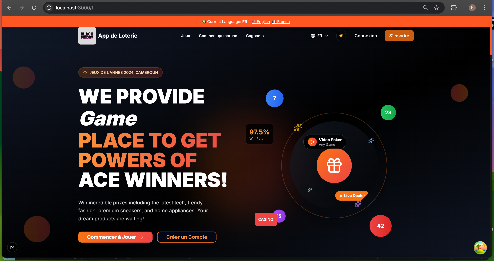

# Lottery Marketing Application

A modern, **mobile-first PWA** for marketing lotteries that allows businesses to promote their products through interactive games with live participant counters and integrated advertising systems.



## ✨ Features

### Core Functionality

- **Real-time Lottery Games**: Create and manage marketing lotteries with live participant counters
- **Interactive Participation**: Users can join games with secure payment processing
- **Automatic Drawing System**: Fair and transparent winner selection when quotas are reached
- **Business Promotion**: Companies can showcase products and boost visibility

### Real-time Technology

- **Firebase Realtime Database**: Live participant counters and game status updates
- **Firestore**: Complex data management for users, games, products, and payments
- **Real-time Notifications**: Instant updates for game progress and results

### Payment Integration

- **Stripe**: Credit card processing for international users
- **Mobile Money**: Orange Money and MTN Mobile Money for African markets
- **Secure Transactions**: End-to-end encrypted payment processing

### Modern Interface

- **Mobile-First Design**: Optimized for mobile devices with responsive layouts
- **PWA Capabilities**: Installable app with offline functionality
- **Real-time Counters**: Live participant numbers visible during games
- **Beautiful UI**: Modern lottery theme with dark backgrounds and orange accents

## Architecture

### Technology Stack

- **Frontend**: Next.js 14 + TypeScript + Tailwind CSS
- **Backend**: Firebase (Firestore + Realtime Database)
- **Authentication**: Firebase Auth
- **Payments**: Stripe + Mobile Money APIs
- **Storage**: Firebase Storage + Cloudinary
- **PWA**: @ducanh2912/next-pwa
- **Deployment**: Vercel

### Database Structure

```
Firestore Collections:
├── users (profiles, roles)
├── categories (game categories)
├── products (company products)
├── games (lottery games)
├── tickets (participations)
├── payments (transactions)
└── enterprises (company profiles)

Realtime Database:
└── gameCounters/{gameId}
    ├── participants (current count)
    ├── status (game state)
    ├── maxParticipants
    └── lastUpdate (timestamp)
```

## Getting Started

### Prerequisites

- Node.js 18+ and Yarn
- Firebase project with Firestore and Realtime Database enabled
- Stripe account (optional, for payment processing)

### 1. Clone and Install

```bash
git clone <repository-url>
cd lottery-app
yarn install
```

### 2. Firebase Setup

1. Create a new Firebase project at [Firebase Console](https://console.firebase.google.com/)
2. Enable the following services:
   - Authentication (Email/Password)
   - Firestore Database
   - Realtime Database
   - Storage
   - Functions (optional)

3. Create a `.env.local` file with your Firebase configuration:

```env
# Firebase Configuration
NEXT_PUBLIC_FIREBASE_API_KEY=your_api_key_here
NEXT_PUBLIC_FIREBASE_AUTH_DOMAIN=your_project.firebaseapp.com
NEXT_PUBLIC_FIREBASE_PROJECT_ID=your_project_id
NEXT_PUBLIC_FIREBASE_STORAGE_BUCKET=your_project.appspot.com
NEXT_PUBLIC_FIREBASE_MESSAGING_SENDER_ID=123456789
NEXT_PUBLIC_FIREBASE_APP_ID=your_app_id
NEXT_PUBLIC_FIREBASE_DATABASE_URL=https://your_project-default-rtdb.firebaseio.com
```

### 3. PWA Setup

The app is already configured with PWA support using `@ducanh2912/next-pwa`. The configuration includes:

- **Service Worker**: Automatic registration and caching
- **Web App Manifest**: App metadata and icons
- **Offline Support**: Basic caching strategies
- **Install Prompt**: "Add to Home Screen" functionality

### 4. Database Rules Setup

#### Firestore Rules (`firestore.rules`)

```javascript
rules_version = '2';
service cloud.firestore {
  match /databases/{database}/documents {
    // Users collection
    match /users/{userId} {
      allow read: if request.auth != null && (request.auth.uid == userId || resource.data.role == 'ADMIN');
      allow create: if request.auth != null && request.auth.uid == userId;
      allow update: if request.auth != null && request.auth.uid == userId;
      allow delete: if false; // Users cannot be deleted, only deactivated
    }

    // Games collection
    match /games/{gameId} {
      allow read: if true; // Public read access
      allow create: if request.auth != null &&
        (get(/databases/$(database)/documents/users/$(request.auth.uid)).data.role in ['ADMIN', 'VENDOR']);
      allow update: if request.auth != null &&
        (resource.data.createdBy == request.auth.uid ||
         get(/databases/$(database)/documents/users/$(request.auth.uid)).data.role == 'ADMIN');
      allow delete: if request.auth != null &&
        get(/databases/$(database)/documents/users/$(request.auth.uid)).data.role == 'ADMIN';
    }

    // Tickets collection
    match /tickets/{ticketId} {
      allow read: if request.auth != null &&
        (resource.data.userId == request.auth.uid ||
         get(/databases/$(database)/documents/users/$(request.auth.uid)).data.role == 'ADMIN');
      allow create: if request.auth != null && request.auth.uid == resource.data.userId;
      allow update: if false; // Tickets cannot be modified after creation
      allow delete: if false; // Tickets cannot be deleted
    }
  }
}
```

#### Realtime Database Rules (`database.rules.json`)

```json
{
  "rules": {
    "users": {
      "$uid": {
        ".read": "$uid === auth.uid || root.child('users').child(auth.uid).child('role').val() === 'ADMIN'",
        ".write": "$uid === auth.uid",
        ".validate": "newData.hasChildren(['email', 'firstName', 'lastName', 'role'])"
      }
    },
    "gameCounters": {
      "$gameId": {
        ".read": "auth != null",
        ".write": "auth != null && (root.child('users').child(auth.uid).child('role').val() in ['ADMIN', 'VENDOR'] || root.child('games').child($gameId).child('createdBy').val() === auth.uid)"
      }
    }
  }
}
```

### 5. Deploy Database Rules

**Firestore Rules:**

```bash
firebase deploy --only firestore:rules
```

**Realtime Database Rules:**

```bash
firebase deploy --only database
```

### 6. Run Development Server

```bash
yarn dev
```

Open [http://localhost:3000](http://localhost:3000) to view the application.

## Mobile-First Design

### Design Philosophy

- **Mobile-First Approach**: All components designed for mobile devices first
- **Responsive Grid System**: Adapts seamlessly to tablet and desktop
- **Touch-Friendly Interface**: Optimized for mobile interactions
- **Progressive Enhancement**: Enhanced features on larger screens

### Color Scheme

- **Primary Background**: Dark charcoal (`#1a1a1a`)
- **Secondary Background**: Dark gray (`#0f0f0f`)
- **Primary Accent**: Vibrant orange (`#FF5722`)
- **Secondary Accent**: Warm orange (`#FF9800`)
- **Text Colors**: White, light gray, and orange accents

### Responsive Breakpoints

- **Mobile**: < 768px (default)
- **Tablet**: 768px - 1024px
- **Desktop**: > 1024px

## PWA Features

### App Installation

- **Web App Manifest**: Complete app metadata
- **Install Prompt**: Native app-like installation
- **App Icons**: Multiple sizes for different devices
- **Splash Screen**: Custom loading experience

### Offline Functionality

- **Service Worker**: Caches essential resources
- **Offline First**: Works without internet connection
- **Background Sync**: Syncs data when connection returns
- **Push Notifications**: Real-time updates (future feature)

### Performance

- **Lazy Loading**: Components load on demand
- **Image Optimization**: Next.js automatic optimization
- **Code Splitting**: Automatic bundle optimization
- **Caching Strategy**: Intelligent resource caching

## Usage

### For Users

1. **Register/Login**: Create an account or sign in
2. **Browse Games**: View available lottery games
3. **Participate**: Purchase tickets for games you're interested in
4. **Track Progress**: Monitor real-time participant counters
5. **Receive Results**: Get notified when games are drawn

### For Businesses/Admins

1. **Create Products**: Add your products to the platform
2. **Launch Games**: Create lottery games with your products
3. **Monitor Engagement**: Track real-time participation and views
4. **Boost Visibility**: Use advertising features to promote games
5. **Manage Results**: Handle drawing and winner notifications

## Development

### Project Structure

```
src/
├── app/                    # Next.js app router pages
│   ├── [locale]/          # Internationalized routes
│   │   ├── en/            # English locale pages
│   │   ├── fr/            # French locale pages
│   │   ├── admin/         # Admin panel pages
│   │   ├── auth/          # Authentication pages
│   │   ├── dashboard/     # User dashboard
│   │   ├── games/         # Games listing
│   │   ├── layout.tsx     # Locale-specific layout
│   │   └── page.tsx       # Home page with locale
│   ├── globals.css        # Global styles
│   ├── layout.tsx         # Root layout
│   └── page.tsx           # Root redirect
├── components/             # Reusable components
│   ├── ui/                # shadcn/ui components
│   ├── providers/         # Context providers
│   └── home/              # Home page components
├── lib/                    # Utility libraries
│   ├── firebase/          # Firebase configuration and services
│   ├── i18n/              # Internationalization
│   ├── themes/            # Theme management
│   ├── constants/         # Project constants
│   └── utils/             # Helper functions
├── types/                  # TypeScript type definitions
└── hooks/                 # Custom React hooks
```

### Root Level Files

```
lottery-app/
├── firestore.rules         # Firestore security rules
├── database.rules.json     # Realtime Database rules
├── next.config.js          # Next.js configuration
├── tailwind.config.ts      # Tailwind CSS configuration
├── package.json            # Dependencies and scripts
├── .github/                # GitHub Actions workflows
├── .husky/                 # Git hooks configuration
├── .eslintrc.json          # ESLint configuration
├── .prettierrc             # Prettier configuration
└── public/                 # Static assets
    ├── icons/              # PWA icons
    ├── images/             # App images
    └── manifest.json       # PWA manifest
```

### Key Components

#### Real-time Game Counter

```typescript
import { useGameCounter } from '@/lib/hooks/useGameCounter';

function GameCounter({ gameId }: { gameId: string }) {
  const { counter, loading, error } = useGameCounter(gameId);

  if (loading) return <div>Loading...</div>;
  if (error) return <div>Error: {error}</div>;

  return (
    <div className="text-2xl font-bold">
      {counter?.participants || 0} / {counter?.maxParticipants || 0} Participants
    </div>
  );
}
```

#### Firebase Services

```typescript
import { firestoreService, realtimeService } from '@/lib/firebase/services';

// Create a new game
const gameId = await firestoreService.createGame({
  title: 'Win an iPhone!',
  ticketPrice: 1000,
  maxParticipants: 100,
  // ... other fields
});

// Initialize real-time counter
await realtimeService.updateGameCounter(gameId, {
  participants: 0,
  status: 'ACTIVE',
  maxParticipants: 100,
});
```

## Deployment

### Vercel Deployment

1. Connect your GitHub repository to Vercel
2. Set environment variables in Vercel dashboard
3. Deploy automatically on push to main branch

### PWA Deployment

- **HTTPS Required**: PWA features only work over HTTPS
- **Service Worker**: Automatically registered on production
- **Manifest**: Automatically served with proper headers
- **Icons**: Ensure all icon sizes are available

### Environment Variables for Production

Ensure all Firebase configuration variables are set in your production environment.

## Security Features

- **Authentication**: Firebase Auth with email/password
- **Authorization**: Role-based access control (USER, ADMIN, ENTERPRISE)
- **Data Validation**: Server-side validation for all inputs
- **Payment Security**: PCI-compliant payment processing
- **Rate Limiting**: API rate limiting to prevent abuse

## Performance

- **Real-time Updates**: < 100ms response time for live counters
- **Optimized Queries**: Efficient Firestore queries with proper indexing
- **CDN Integration**: Static assets served via CDN
- **PWA Features**: Service workers for offline capabilities
- **Mobile Optimization**: Touch-friendly, responsive design

## 🤝 Contributing

1. Fork the repository
2. Create a feature branch (`git checkout -b feature/amazing-feature`)
3. Commit your changes (`git commit -m 'Add amazing feature'`)
4. Push to the branch (`git push origin feature/amazing-feature`)
5. Open a Pull Request

## 📄 License

This project is licensed under the MIT License - see the [LICENSE](LICENSE) file for details.

## 📚 Documentation

For comprehensive documentation, troubleshooting guides, and setup instructions, see the [docs/](docs/) folder.

### 📖 Quick Links

- [📚 Documentation Index](docs/README.md) - Complete documentation overview
- [🌍 i18n Setup Guide](docs/setup/i18n-setup-guide.md) - Internationalization setup
- [🔧 Troubleshooting Guide](docs/troubleshooting/general-troubleshooting.md) - Common issues and solutions
- [🚨 i18n Troubleshooting](docs/internationalization/i18n-troubleshooting-guide.md) - Internationalization issues

## 🆘 Support

- **Documentation**: Check the [docs/](docs/) folder for detailed guides
- **Issues**: Report bugs via GitHub Issues
- **Discussions**: Join community discussions on GitHub

## 🎯 Roadmap

### Phase 1 (Current)

- Basic authentication system
- Real-time game counters
- Game creation and management
- User participation system
- Mobile-first responsive design
- PWA implementation

### Phase 2 (Next)

- Payment integration (Stripe + Mobile Money)
- Automatic drawing system
- Winner notifications
- Business profiles
- Push notifications

### Phase 3 (Future)

- Advanced analytics dashboard
- Advertising system
- Mobile app (React Native)
- Multi-language support
- Advanced PWA features

---

**Built with ❤️ by Avom Brice **
**Check my portfolio at https://maebrieporfolio.vercel.app**

_Mobile-first, PWA-ready, and fully responsive_
